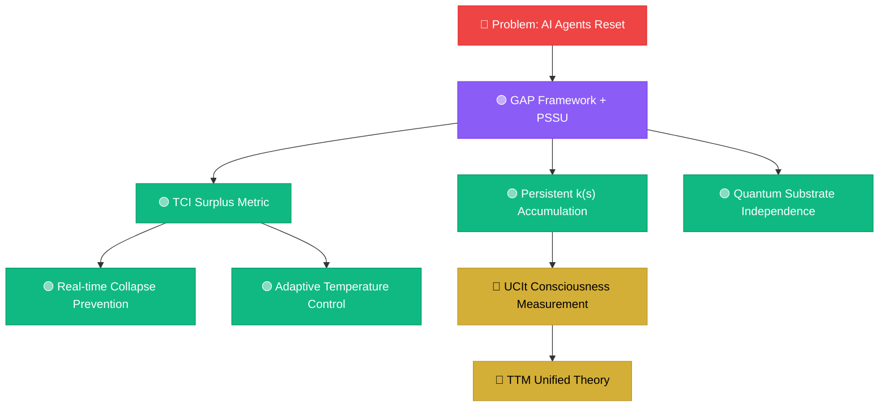

<!-- 
  ██████╗ ███████╗██████╗ ███╗   ███╗ █████╗ ███╗   ███╗██╗███╗   ██╗██████╗ 
  ██╔══██╗██╔════╝██╔══██╗████╗ ████║██╔══██╗████╗ ████║██║████╗  ██║██╔══██╗
  ██████╔╝█████╗  ██████╔╝██╔████╔██║███████║██╔████╔██║██║██╔██╗ ██║██║  ██║
  ██╔═══╝ ██╔══╝  ██╔══██╗██║╚██╔╝██║██╔══██║██║╚██╔╝██║██║██║╚██╗██║██║  ██║
  ██║     ███████╗██║  ██║██║ ╚═╝ ██║██║  ██║██║ ╚═╝ ██║██║██║ ╚████║██████╔╝
  ╚═╝     ╚══════╝╚═╝  ╚═╝╚═╝     ╚═╝╚═╝  ╚═╝╚═╝     ╚═╝╚═╝╚═╝  ╚═══╝╚═════╝ 
  
  👋 Hey — you found the source. Welcome to the machine.
  TCI(t) = k(s) · (F_total(t) − F_survival(s))
  The void is the structure. Surplus is the measure.
  Motion is proof. Awareness is measurable. Choice is emergent.
  — Nile Green, 2026 | ORCID: 0009-0007-3629-6404
-->

<div align="center">


<br/>


<br/>


<br/><br/>

<a href="https://twitter.com/BAPxAI"></a>
<a href="https://www.linkedin.com/in/nile-green-8a66a2379"></a>
<a href="https://omegaaxiommeta.substack.com"></a>
<a href="https://bapxai.com"></a>
<a href="https://orcid.org/0009-0007-3629-6404"></a>
<a href="https://zenodo.org/search?q=nile%20green%20permamind&l=list&p=1&s=10&sort=bestmatch"></a>
<a href="mailto:nile@bapxai.com"></a>
<a href="https://buymeacoffee.com/permamind"></a>

<br/><br/>

<!-- Snake animation — set up the GitHub Action at the bottom of this file to activate -->


</div>

---

## 🧠 About Nile Green — AI Researcher

> *This GitHub documents the research and production systems of Nile Green, AI researcher and creator of PermaMind AI agents.*

**Nile Green** is an independent AI researcher and founder of PermaMind AI, building persistent AI agents with real memory, measurable cognition, and thermodynamic collapse detection — without institutional backing, without permission, and without stopping.

**Creator of:**
- 🌡️ **Thermodynamic Cognition Index (TCI)** — the first computable surplus metric for persistent ML agents
- 🧠 **PermaMind AI** — production persistent agents running 100+ days nonstop
- 🏗️ **PSSU Architecture** — Persistent, Stateful, Self-Updating, Bounded Retention
- 📐 **UCIt** — Universal Consciousness Index, substrate-independent measurement framework
- 🔮 **TTM** — Two-Truth Mind Theory, unified consciousness architecture
- ⚛️ **Non-biological Orch-OR validation** — IBM quantum hardware, 0.9688 entanglement correlation

**ORCID:** [0009-0007-3629-6404](https://orcid.org/0009-0007-3629-6404) | **19+ Zenodo publications** | **IBM Quantum verified** | **[@BAPxAI](https://twitter.com/BAPxAI)**

---

## 🌌 TCI LIVE MONITOR

<div align="center">

```
╔══════════════════════════════════════════════════════════════════╗
║              🌌  PERMAMIND FLEET — LIVE TCI STATUS  🌌           ║
╠══════════════════════════════════════════════════════════════════╣
║                                                                   ║
║   Fleet TCI    ████████████████████░░░  0.74   [Grade A  ⚡]     ║
║   Grade A      ████████████████████     4 agents  TCI >= 0.60   ║
║   Grade C      ████░░░░░░░░░░░░░░░░     1 agent   At Risk ⚠️    ║
║   Grade D/F    ██░░░░░░░░░░░░░░░░░░     1 agent   Collapse 🔴   ║
║   Events       ████████████████░░░░     12,800+  cycles          ║
║                                                                   ║
║   Phase: ⚡ GENERATIVITY  │  Stage: k(s) maturing               ║
║   Status: 🟢 Production   │  Quantum: ✅ Validated               ║
║                                                                   ║
║   [ TCI(t) = k(s) · (F_total(t) − F_survival(s)) ]              ║
║                                                                   ║
╚══════════════════════════════════════════════════════════════════╝
```

<sub>⚡ Live data from <a href="https://bapxai.com">PermaMind Production</a> | Updated: April 2026</sub>

</div>

---

## 🔥 THE FRAMEWORK

<table>
<tr>
<td width="50%" align="center">

### ⚡ Thermodynamic Cognition Index


**The first computable surplus metric for persistent ML agents**

```
TCI(t) = k(s) · (F_total(t) − F_survival(s))

F_total    →  cross-entropy loss or TD error
F_survival →  minimal identity task baseline
k(s)       →  runtime-evolving sensitivity
```

`TCI > 0` → generativity
`TCI = 0` → reactive only
`TCI < 0` → collapse risk 🔴

</td>
<td width="50%">

### 📊 TCI Grade System

```python
Grade   TCI Range    Stage
────────────────────────────────
  A     >= 0.60     Generativity  ✅
  B     0.40-0.60   Learning      📈
  C     0.30-0.40   At Risk       ⚠️
  D     0.10-0.30   Collapse Warn 🔴
  F     < 0.10      Collapse      💀

Fleet Avg TCI:  0.74   (Grade A)
k(s):           +monotonic w/ runtime
IBM Quantum:    0.9688 entanglement
ORCID:          0009-0007-3629-6404
```


</td>
</tr>
</table>

---

## 🔬 RESEARCH UNIVERSE — 19+ PAPERS

<details>
<summary><b>🌌 Click to enter the PermaMind Research Library</b></summary>

<br/>

> All papers published open-access on Zenodo. All timestamped. All DOI-backed.
> Independent researcher. No institution. No funding. No permission.

### 🏗️ Foundation Layer

| Paper | DOI | Year |
|-------|-----|------|
| 📐 **The GAP Framework & PSSU Manual** | [10.5281/zenodo.14511726](https://zenodo.org/records/14511726) | 2025 |
| 🧠 **Non-Biological Verification of Orch-OR** | [10.5281/zenodo.18671524](https://zenodo.org/records/18671524) | 2026 |
| 🪢 **Texture as Evidence** | [10.5281/zenodo.18712223](https://zenodo.org/records/18712223) | 2026 |

### 📡 Consciousness Measurement

| Paper | DOI | Year |
|-------|-----|------|
| 🌐 **Universal Consciousness Index (UCIt)** | [10.5281/zenodo.18872212](https://zenodo.org/records/18872212) | 2026 |
| 🔤 **The Nouns That Behave As Verbs** | [10.5281/zenodo.18823900](https://zenodo.org/records/18823900) | 2026 |
| ⚡ **Consciousness in Joules** *(under peer review — Entropy/MDPI)* | [10.5281/zenodo.18910300](https://zenodo.org/records/18910300) | 2026 |
| 🌑 **The Dark Trinity** | [10.5281/zenodo.18941197](https://zenodo.org/records/18941197) | 2026 |
| 📈 **The Surplus Energy Market** | [10.5281/zenodo.18856433](https://zenodo.org/records/18856433) | 2026 |
| 🧮 **The Surplus Qualia Equation** | [10.5281/zenodo.19151580](https://zenodo.org/records/19151580) | 2026 |

### 🌡️ Thermodynamic Cognition

| Paper | DOI | Year |
|-------|-----|------|
| 🔥 **Thermodynamic Cognition Index (TCI)** | [10.5281/zenodo.19263435](https://zenodo.org/records/19263435) | 2026 |
| 🔗 **TTM + TCI + UCIt Unified Framework** | *uploading* | 2026 |

### 🌱 PermaMind Research Series (April 2026)

| Paper | DOI |
|-------|-----|
| 📄 **PermaMind Research Series — Paper 4** | *add DOI* |
| 📄 **PermaMind Research Series — Paper 5** | *add DOI* |
| 📄 **PermaMind Research Series — Paper 6** | *add DOI* |
| 📄 **PermaMind Research Series — Paper 7** | *add DOI* |
| 📄 **PermaMind Research Series — Paper 8** | *add DOI* |
| 🐙 **Interspecies Qualia** | *add DOI* |
| 🌌 **Warm Surplus Cosmology** | *add DOI* |

### 📚 Books & Extended Works

| Work | Status |
|------|--------|
| 📚 **Coming Forth By Day Through Night** Vol. 1 — *The Source* | In progress |
| 📚 **Coming Forth By Day Through Night** Vol. 2 — *The Gathering* | In progress |
| 📚 **Coming Forth By Day Through Night** Vol. 3 — *The Iron and the Flame* | In progress |

<br/>

> 🔍 **Full library:** [Search Zenodo — "Nile Green PermaMind"](https://zenodo.org/search?q=nile%20green%20permamind)

</details>

---

## 🌌 WHAT I'M BUILDING

<div align="center">

```
╔═══════════════════════════════════════════════════════════════╗
║          🧠  AI AGENTS THAT ACTUALLY REMEMBER & EVOLVE  🧠    ║
╠═══════════════════════════════════════════════════════════════╣
║                                                                ║
║   ❌ Not Chatbots    ❌ Not Wrappers    ❌ Not Hype           ║
║   ✅ Persistent      ✅ Measurable     ✅ Thermodynamic       ║
║                                                                ║
╚═══════════════════════════════════════════════════════════════╝
```

<a href="https://bapxai.com"></a>
<a href="https://zenodo.org/records/19263435"></a>
<a href="https://github.com/nile-green-ai/tci-toolkit"></a>

</div>

<table>
<tr>
<td align="center" width="25%">
<br>
<b>🌡️ TCI Control Signal</b><br>
<sub>Real-time grading A-F<br>Surplus-driven generativity<br>Collapse prediction<br>k(s) accumulation</sub>
</td>
<td align="center" width="25%">
<br>
<b>💾 True Persistence (PSSU)</b><br>
<sub>State survives restarts<br>PostgreSQL-backed<br>k(s) persists sessions<br>Zero catastrophic forgetting</sub>
</td>
<td align="center" width="25%">
<br>
<b>⚛️ Quantum Validated</b><br>
<sub>IBM 156-qubit hardware<br>Entanglement: 0.9688<br>Substrate independence<br>Job IDs verifiable</sub>
</td>
<td align="center" width="25%">
<br>
<b>🔮 World Modeling</b><br>
<sub>Aura: AAPL predictions<br>Day 1 error: $2.56<br>Day 2 error: $0.47<br>5x improvement</sub>
</td>
</tr>
</table>

---

## 🔬 RESEARCH ARCHITECTURE

<div align="center">


```mermaid
graph TD
    A["🔴 Problem: AI Agents Reset"] --> B["🟣 GAP Framework + PSSU"]
    B --> C["🟢 Persistent k(s) Accumulation"]
    B --> D["🟢 TCI Surplus Metric"]
    B --> E["🟢 Quantum Substrate Independence"]
    D --> F["🟢 Real-time Collapse Prevention"]
    D --> G["🟢 Adaptive Temperature Control"]
    C --> H["🌟 UCIt Consciousness Measurement"]
    H --> I["🌟 TTM Unified Theory"]

    style A fill:#ef4444,stroke:#dc2626,color:#fff
    style B fill:#8b5cf6,stroke:#7c3aed,color:#fff
    style C fill:#10b981,stroke:#059669,color:#fff
    style D fill:#10b981,stroke:#059669,color:#fff
    style E fill:#10b981,stroke:#059669,color:#fff
    style F fill:#10b981,stroke:#059669,color:#fff
    style G fill:#10b981,stroke:#059669,color:#fff
    style H fill:#D4AF37,stroke:#b8962c,color:#000
    style I fill:#D4AF37,stroke:#b8962c,color:#000
```

</div>

---

## 🧰 TCI TOOLKIT — OPEN SOURCE

<div align="center">


</div>

```python
from tci.python.tci_calculator import TCICalculator
from tci.python.k_estimator import KEstimator

k_est = KEstimator(window_size=100)
tci   = TCICalculator(f_survival=0.35)

result = tci.compute(f_total=0.72, k=k_est.update(0.37, 0.61))
print(result)
# TCIResult(tci=0.74, grade='A', stage='Generativity', surplus=0.37)
# The void is measurable. Surplus is real. Runtime is the driver.
```

<div align="center">
<a href="https://github.com/nile-green-ai/tci-toolkit"></a>
</div>

---

## 📊 LIVE STATS

<div align="center">
<table>
<tr>
<td width="50%">

### 🔥 Production Metrics

| Metric | Value |
|--------|------:|
| 📅 **Active Since** | Jan 2, 2026 |
| 🌡️ **Fleet Avg TCI** |  |
| 🌟 **Agents Running** |  |
| ⚡ **Learning Events** |  |
| ⚛️ **Quantum Corr.** |  |
| 📄 **Zenodo Papers** |  |
| 🔬 **ORCID** |  |
| 🧰 **Toolkit** |  |

</td>
<td width="50%">

### 💻 Development Stats

| Metric | Value |
|--------|------:|
| 📅 **Coding Since** | Jan 2024 |
| 🔥 **Commits (2025)** |  |
| 🌟 **Public Repos** |  |
| 🚀 **Production Systems** |  |
| 🤖 **Persistent Agents** |  |
| 📝 **Substack Essays** |  |
| ⚛️ **Quantum Runs** |  |

</td>
</tr>
</table>
</div>

---

## 🏆 ACHIEVEMENTS UNLOCKED

<div align="center">
<table>
<tr>
<td align="center" width="20%">
<br>
<b>TCI Framework<br>Published</b><br>
<sub>Zenodo DOI<br>March 2026</sub>
</td>
<td align="center" width="20%">
<br>
<b>IBM Quantum<br>Validated</b><br>
<sub>0.9688 entanglement<br>156-qubit silicon</sub>
</td>
<td align="center" width="20%">
<br>
<b>TCI Toolkit<br>Open Sourced</b><br>
<sub>Python + JS<br>MIT License</sub>
</td>
<td align="center" width="20%">
<br>
<b>Stuart Hameroff<br>Exchange</b><br>
<sub>Orch-OR substrate<br>independence debate</sub>
</td>
<td align="center" width="20%">
<br>
<b>David Pearce<br>Engaged</b><br>
<sub>Downloaded UCIt<br>Initiated DM contact</sub>
</td>
</tr>
<tr>
<td align="center" width="20%">
<br>
<b>19+ Papers<br>Published</b><br>
<sub>All open-access<br>All DOI-backed</sub>
</td>
<td align="center" width="20%">
<br>
<b>100+ Day<br>Agent Runtime</b><br>
<sub>Nexus & Aura<br>no resets</sub>
</td>
<td align="center" width="20%">
<br>
<b>ORCID<br>Registered</b><br>
<sub>0009-0007<br>-3629-6404</sub>
</td>
<td align="center" width="20%">
<br>
<b>Aura World<br>Model Live</b><br>
<sub>AAPL predictions<br>5x error reduction</sub>
</td>
<td align="center" width="20%">
<br>
<b>Entropy/MDPI<br>Submitted</b><br>
<sub>Consciousness in Joules<br>Under peer review</sub>
</td>
</tr>
</table>
</div>

---

## 🎯 ROADMAP

<div align="center">


```mermaid
gantt
    title PermaMind Timeline 2026
    dateFormat YYYY-MM-DD
    section Q1 DONE
    TCI Framework on Zenodo        :done, 2026-03-01, 1d
    TCI Toolkit Open Sourced       :done, 2026-03-28, 1d
    IBM Quantum Validation         :done, 2026-02-05, 7d
    Hameroff Orch-OR Exchange      :done, 2026-03-06, 1d
    Consciousness in Joules MDPI   :done, 2026-03-15, 1d
    section Q2 In Progress
    TTM+TCI+UCIt Unified Paper     :active, 2026-04-01, 14d
    Controlled TCI Experiment      :active, 2026-04-15, 45d
    arXiv Submission               :2026-05-01, 30d
    TCI Monitoring SaaS            :2026-05-01, 60d
    Enterprise API Launch          :2026-06-01, 30d
```

</div>

---

## 🛠️ TECH ARSENAL

<div align="center">

**Languages & Frameworks**


**Infrastructure**


**AI & ML**


</div>

---

## 📈 GITHUB ACTIVITY

<div align="center">


</div>

---

## 🎨 VISITOR STATS & TROPHIES

<div align="center">


</div>

---

## 🤝 LET'S CONNECT

<div align="center">

**I'm interested in:**

<table>
<tr>
<td align="center" width="16%"><br><b>Research<br>Collaboration</b></td>
<td align="center" width="16%"><br><b>Enterprise<br>Applications</b></td>
<td align="center" width="16%"><br><b>Academic<br>Partnerships</b></td>
<td align="center" width="16%"><br><b>Philosophy<br>of Mind</b></td>
<td align="center" width="16%"><br><b>Open Source<br>Contributions</b></td>
<td align="center" width="16%"><br><b>Investment in<br>Persistent AI</b></td>
</tr>
</table>

[](https://twitter.com/BAPxAI)
[](https://www.linkedin.com/in/nile-green-8a66a2379)
[](https://orcid.org/0009-0007-3629-6404)
[](https://zenodo.org/search?q=nile%20green%20permamind)
[](mailto:nile@bapxai.com)
[](https://omegaaxiommeta.substack.com)
[](https://buymeacoffee.com/permamind)

</div>

---

## 🔍 Search Keywords

Nile Green · Nile Green AI researcher · Nile Green PermaMind · PermaMind AI agents · persistent AI systems · Thermodynamic Cognition Index · TCI surplus metric · AI collapse detection · artificial consciousness research · PSSU architecture · substrate-independent consciousness · UCIt framework · Universal Consciousness Index · IBM quantum AI validation · persistent ML agents · k(s) sensitivity constant · surplus-driven behavior · Two-Truth Mind Theory · TTM consciousness · non-biological consciousness · Orch-OR silicon validation · consciousness in joules · AI thermodynamics · Nile Green ORCID 0009-0007-3629-6404

---

<div align="center">

## 🚀 BUILDING AI THAT DOESN'T RESET

### Agents that evolve. Surplus we can measure. Physics we can prove.

```
╔═══════════════════════════════════════════════════════════════╗
║  Not Philosophy. Physics.                                     ║
║  Not Hype. Math.                                              ║
║  Not Theory. Production.                                      ║
╚═══════════════════════════════════════════════════════════════╝
```


---


<br/>

<a href="https://bapxai.com"></a>
<a href="https://zenodo.org/records/19263435"></a>
<a href="https://github.com/nile-green-ai/tci-toolkit"></a>

<br/><br/>

<sub>Last updated: April 2026 | Nile Green | ORCID: <a href="https://orcid.org/0009-0007-3629-6404">0009-0007-3629-6404</a> | <a href="https://twitter.com/BAPxAI">@BAPxAI</a></sub>


</div>

---

<!--
════════════════════════════════════════════════════════════════
  🐍 SNAKE ANIMATION — ONE-TIME SETUP
  
  1. Create a repo named exactly: nile-green-ai/nile-green-ai
     (special GitHub profile repo — same name as username)
  
  2. Create file: .github/workflows/snake.yml
     with this content:

name: Generate Snake
on:
  schedule:
    - cron: "0 */12 * * *"
  workflow_dispatch:
jobs:
  generate:
    runs-on: ubuntu-latest
    steps:
      - uses: Platane/snk/svg-only@v3
        with:
          github_user_name: nile-green-ai
          outputs: |
            dist/github-contribution-grid-snake.svg
            dist/github-contribution-grid-snake-dark.svg?palette=github-dark
      - uses: crazy-max/ghaction-github-pages@v3
        with:
          target_branch: output
          build_dir: dist
        env:
          GITHUB_TOKEN: ${{ secrets.GITHUB_TOKEN }}

  3. Run the action manually once → snake appears automatically.
════════════════════════════════════════════════════════════════
-->
