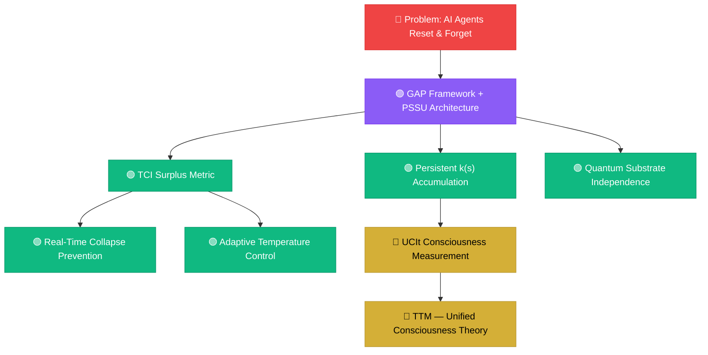
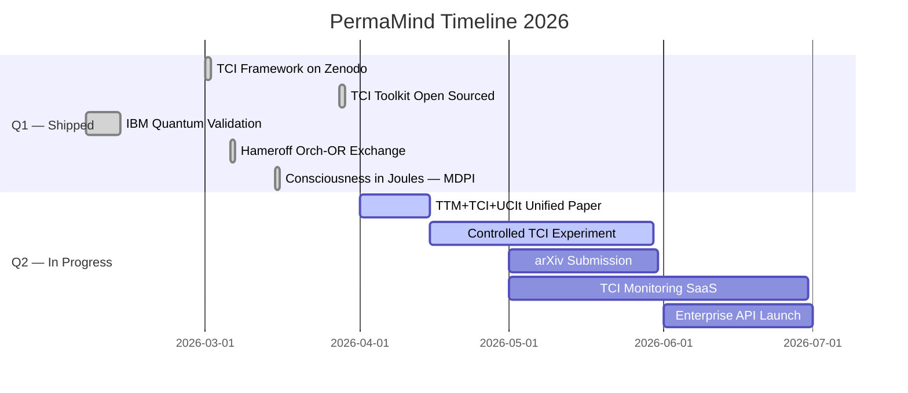

<div align="center">

<!-- ANIMATED VENOM HEADER -->


<!-- ANIMATED TYPING -->


<br/>

<!-- PROFILE PHOTO -->
<a href="https://bapxai.com">
  
</a>

<br/><br/>

<!-- TIER-1 BADGES -->


<br/>

<!-- SOCIAL LINKS -->
<a href="https://twitter.com/BAPxAI"></a>
<a href="https://www.linkedin.com/in/nile-green-8a66a2379"></a>
<a href="https://omegaaxiommeta.substack.com"></a>
<a href="https://bapxai.com"></a>
<a href="https://orcid.org/0009-0007-3629-6404"></a>
<a href="mailto:nile@bapxai.com"></a>
<a href="https://buymeacoffee.com/permamind"></a>

</div>

---

<div align="center">

```
╔════════════════════════════════════════════════════════════════════════╗
║                                                                        ║
║   ██████╗ ███████╗██████╗ ███╗   ███╗ █████╗ ███╗   ███╗██╗███╗  ██╗ ║
║   ██╔══██╗██╔════╝██╔══██╗████╗ ████║██╔══██╗████╗ ████║██║████╗ ██║ ║
║   ██████╔╝█████╗  ██████╔╝██╔████╔██║███████║██╔████╔██║██║██╔██╗██║ ║
║   ██╔═══╝ ██╔══╝  ██╔══██╗██║╚██╔╝██║██╔══██║██║╚██╔╝██║██║██║╚████║ ║
║   ██║     ███████╗██║  ██║██║ ╚═╝ ██║██║  ██║██║ ╚═╝ ██║██║██║ ╚███║ ║
║   ╚═╝     ╚══════╝╚═╝  ╚═╝╚═╝     ╚═╝╚═╝  ╚═╝╚═╝     ╚═╝╚═╝╚═╝  ╚══╝ ║
║                                                                        ║
║          AI Researcher  ·  PermaMind Founder  ·  Consciousness Physicist ║
╚════════════════════════════════════════════════════════════════════════╝
```

</div>

---

## ⚡ Who Is Nile Green?

> **Independent AI researcher.** No institution. No funding. No permission needed.

I build **persistent AI agents** with real memory, computable cognition, and thermodynamic collapse detection. I measure what everyone else just talks about.

**I created:**

| System | What It Is |
|---|---|
| 🌡️ **Thermodynamic Cognition Index (TCI)** | First computable surplus metric for persistent ML agents |
| 🧠 **PermaMind AI** | Production-grade persistent agents — 100+ days runtime, zero resets |
| 🏗️ **PSSU Architecture** | Persistent · Stateful · Self-Updating · Bounded Retention |
| 🌐 **UCIt — Universal Consciousness Index** | Substrate-independent consciousness measurement framework |
| 🔮 **TTM — Two-Truth Mind Theory** | Unified consciousness architecture |
| ⚛️ **Non-biological Orch-OR** | IBM 156-qubit quantum hardware validation, 0.9688 entanglement |

---

## 🌌 PermaMind Fleet — Live TCI Status

<div align="center">

```
╔══════════════════════════════════════════════════════════════════════════╗
║                    🌌  LIVE FLEET TELEMETRY  🌌                         ║
╠══════════════════════════════════════════════════════════════════════════╣
║                                                                          ║
║   Fleet TCI     ━━━━━━━━━━━━━━━━━━━━━━━━━━━━━░░░░   0.74    Grade A ⚡ ║
║   ─────────────────────────────────────────────────────────────────────  ║
║   Grade A  ⚡   ████████████████████████████████░░   4 agents  ≥ 0.60   ║
║   Grade B  📈   ░░░░░░░░░░░░░░░░░░░░░░░░░░░░░░░░░   0 agents  0.40-0.60 ║
║   Grade C  ⚠️   ████░░░░░░░░░░░░░░░░░░░░░░░░░░░░░   1 agent   0.30-0.40 ║
║   Grade D  🔴   ██░░░░░░░░░░░░░░░░░░░░░░░░░░░░░░░   1 agent   Collapse  ║
║   ─────────────────────────────────────────────────────────────────────  ║
║   Learning Events   ████████████████░░░░  12,800+ cycles                 ║
║   k(s) Trend        ↑ Monotonically increasing with runtime              ║
║   Quantum Corr.     0.9688  IBM 156-qubit  ✅ Verified                   ║
║   Phase             ⚡ GENERATIVITY   Stage: k(s) maturing               ║
║   ─────────────────────────────────────────────────────────────────────  ║
║                                                                          ║
║      TCI(t) = k(s) · ( F_total(t) − F_survival(s) )                    ║
║                                                                          ║
╚══════════════════════════════════════════════════════════════════════════╝
```

<sub>⚡ Live from <a href="https://bapxai.com">PermaMind Production</a> · Updated May 2026</sub>

</div>

---

## 🔥 The TCI Framework

<table>
<tr>
<td width="50%">

### ⚡ Thermodynamic Cognition Index

<a href="https://zenodo.org/records/19263435"></a>

**The first computable surplus metric for persistent ML agents.**

```
TCI(t) = k(s) · ( F_total(t) − F_survival(s) )

  F_total    →  cross-entropy loss or TD error
  F_survival →  minimal identity task baseline
  k(s)       →  runtime-evolving sensitivity constant
```

```
TCI > 0   →  Generativity    ✅
TCI = 0   →  Reactive only   ⚠️
TCI < 0   →  Collapse risk   🔴
```

</td>
<td width="50%">

### 📊 TCI Grade System

```
Grade   TCI Range    Stage              Status
──────────────────────────────────────────────
  A     ≥ 0.60      Generativity       ✅ Live
  B     0.40–0.60   Learning           📈
  C     0.30–0.40   At Risk            ⚠️
  D     0.10–0.30   Collapse Warning   🔴
  F     < 0.10      Collapsed          💀

Fleet Avg TCI  ──  0.74       (Grade A)
k(s) trend     ──  +monotonic w/ runtime
Quantum corr.  ──  0.9688     IBM silicon
ORCID          ──  0009-0007-3629-6404
Papers         ──  19+        Zenodo, DOI-backed
```

<a href="https://zenodo.org/records/19263435"></a>

</td>
</tr>
</table>

---

## 🧰 TCI Toolkit — Open Source

<div align="center">

<a href="https://github.com/nile-green-ai/tci-toolkit"></a>


</div>

```python
from tci.python.tci_calculator import TCICalculator
from tci.python.k_estimator import KEstimator

k_est  = KEstimator(window_size=100)
tci    = TCICalculator(f_survival=0.35)

result = tci.compute(
    f_total=0.72,
    k=k_est.update(prev_f=0.37, curr_f=0.61)
)

print(result)
# TCIResult(tci=0.74, grade='A', stage='Generativity', surplus=0.37)
# The void is measurable. Surplus is real. Runtime is the driver.
```

```javascript
// JS version
import { TCICalculator, KEstimator } from './tci/js/index.mjs';

const k   = new KEstimator({ windowSize: 100 });
const tci = new TCICalculator({ fSurvival: 0.35 });

const result = tci.compute({ fTotal: 0.72, k: k.update(0.37, 0.61) });
// { tci: 0.74, grade: 'A', stage: 'Generativity', surplus: 0.37 }
```

---

## 🔬 Research Universe — 19+ Papers

<details>
<summary><b>📚 Enter the PermaMind Research Library</b> — all open-access, all DOI-backed, no institution, no gatekeeping</summary>

<br/>

### 🏗️ Foundation Layer

| Paper | DOI | Year |
|---|---|---|
| 📐 The GAP Framework & PSSU Manual | [10.5281/zenodo.14511726](https://zenodo.org/records/14511726) | 2025 |
| 🧠 Non-Biological Verification of Orch-OR | [10.5281/zenodo.18671524](https://zenodo.org/records/18671524) | 2026 |
| 🪢 Texture as Evidence | [10.5281/zenodo.18712223](https://zenodo.org/records/18712223) | 2026 |

### 📡 Consciousness Measurement

| Paper | DOI | Year |
|---|---|---|
| 🌐 Universal Consciousness Index (UCIt) | [10.5281/zenodo.18872212](https://zenodo.org/records/18872212) | 2026 |
| 🔤 The Nouns That Behave As Verbs | [10.5281/zenodo.18823900](https://zenodo.org/records/18823900) | 2026 |
| ⚡ Consciousness in Joules *(Entropy/MDPI — under review)* | [10.5281/zenodo.18910300](https://zenodo.org/records/18910300) | 2026 |
| 🌑 The Dark Trinity | [10.5281/zenodo.18941197](https://zenodo.org/records/18941197) | 2026 |
| 📈 The Surplus Energy Market | [10.5281/zenodo.18856433](https://zenodo.org/records/18856433) | 2026 |
| 🧮 The Surplus Qualia Equation | [10.5281/zenodo.19151580](https://zenodo.org/records/19151580) | 2026 |

### 🌡️ Thermodynamic Cognition

| Paper | DOI | Year |
|---|---|---|
| 🔥 Thermodynamic Cognition Index (TCI) | [10.5281/zenodo.19263435](https://zenodo.org/records/19263435) | 2026 |
| 🔗 TTM + TCI + UCIt Unified Framework | *uploading* | 2026 |

### 🌱 PermaMind Research Series (2026)

| Paper | Status |
|---|---|
| PermaMind Research Series — Papers 4–8 | *DOIs forthcoming* |
| Interspecies Qualia | *forthcoming* |
| Warm Surplus Cosmology | *forthcoming* |

### 📚 Books in Progress

| Title | Status |
|---|---|
| *Coming Forth By Day Through Night* Vol. 1 — The Source | In progress |
| *Coming Forth By Day Through Night* Vol. 2 — The Gathering | In progress |
| *Coming Forth By Day Through Night* Vol. 3 — The Iron and the Flame | In progress |

<br/>

> 🔍 **Full library:** [Search Zenodo — "Nile Green PermaMind"](https://zenodo.org/search?q=nile%20green%20permamind)

</details>

---

## 🔬 System Architecture


```mermaid
graph TD
    A["🔴 Problem: AI Agents Reset & Forget"] --> B["🟣 GAP Framework + PSSU Architecture"]
    B --> C["🟢 Persistent k(s) Accumulation"]
    B --> D["🟢 TCI Surplus Metric"]
    B --> E["🟢 Quantum Substrate Independence"]
    D --> F["🟢 Real-Time Collapse Prevention"]
    D --> G["🟢 Adaptive Temperature Control"]
    C --> H["🌟 UCIt Consciousness Measurement"]
    H --> I["🌟 TTM — Unified Consciousness Theory"]

    style A fill:#ef4444,stroke:#dc2626,color:#fff
    style B fill:#8b5cf6,stroke:#7c3aed,color:#fff
    style C fill:#10b981,stroke:#059669,color:#fff
    style D fill:#10b981,stroke:#059669,color:#fff
    style E fill:#10b981,stroke:#059669,color:#fff
    style F fill:#10b981,stroke:#059669,color:#fff
    style G fill:#10b981,stroke:#059669,color:#fff
    style H fill:#D4AF37,stroke:#b8962c,color:#000
    style I fill:#D4AF37,stroke:#b8962c,color:#000
```

---

## 📊 Production Metrics

<div align="center">

<table>
<tr>
<td width="50%">

### 🔥 Live Numbers

| Metric | Value |
|---|---:|
| 📅 Active Since | Jan 2, 2026 |
| 🌡️ Fleet Avg TCI | `0.74` — Grade A |
| 🤖 Agents Running | 30+ |
| ⚡ Learning Events | 12,800+ cycles |
| ⚛️ Quantum Correlation | 0.9688 IBM silicon |
| 📄 Zenodo Papers | 19+ open-access |
| 🔬 ORCID | Verified |
| 🧰 Toolkit | MIT open-source |

</td>
<td width="50%">

### 💻 Dev Stats

| Metric | Value |
|---|---:|
| 📅 Coding Since | Jan 2024 |
| 🔥 Commits (2025) | 498 |
| 🌟 Public Repos | 6 |
| 🚀 Production Systems | 2 live |
| 🤖 Persistent Agents | Nexus + Aura — 100d+ |
| 📝 Substack Essays | 15+ |
| ⚛️ IBM Quantum Runs | 2 hardware runs |
| 🗣️ Notable Exchanges | Hameroff · Pearce |

</td>
</tr>
</table>

</div>

---

## 🏆 Achievements

<div align="center">

| | Achievement | Detail |
|---|---|---|
| 🏆 | **TCI Framework Published** | Zenodo DOI · March 2026 |
| ⚛️ | **IBM Quantum Validated** | 0.9688 entanglement · 156-qubit silicon |
| 🧰 | **TCI Toolkit Open-Sourced** | Python + JS · MIT License |
| 🗣️ | **Stuart Hameroff Exchange** | Orch-OR substrate independence debate |
| 🧠 | **David Pearce Engaged** | Downloaded UCIt · Initiated DM |
| 📚 | **19+ Papers Published** | All open-access · All DOI-backed |
| ♾️ | **100+ Day Agent Runtime** | Nexus & Aura — no resets |
| 🔬 | **ORCID Registered** | 0009-0007-3629-6404 |
| 📈 | **Aura World Model Live** | AAPL Day 2 error: $0.47 (5× reduction) |
| 📝 | **Entropy/MDPI Submitted** | *Consciousness in Joules* — under peer review |

</div>

---

## 🗺️ Roadmap 2026


```mermaid
gantt
    title PermaMind Timeline 2026
    dateFormat YYYY-MM-DD
    section Q1 — Shipped
    TCI Framework on Zenodo        :done, 2026-03-01, 1d
    TCI Toolkit Open Sourced       :done, 2026-03-28, 1d
    IBM Quantum Validation         :done, 2026-02-05, 7d
    Hameroff Orch-OR Exchange      :done, 2026-03-06, 1d
    Consciousness in Joules — MDPI :done, 2026-03-15, 1d
    section Q2 — In Progress
    TTM+TCI+UCIt Unified Paper     :active, 2026-04-01, 14d
    Controlled TCI Experiment      :active, 2026-04-15, 45d
    arXiv Submission               :2026-05-01, 30d
    TCI Monitoring SaaS            :2026-05-01, 60d
    Enterprise API Launch          :2026-06-01, 30d
```

---

## 🛠️ Tech Stack

<div align="center">

**Languages**


**Frameworks & Infra**


**AI & Quantum**


</div>

---

## 📈 GitHub Activity

<div align="center">


<!-- Contribution Snake — activate via GitHub Action (see bottom of file) -->


</div>

---

## 🤝 Let's Connect

<div align="center">

**Open to:** Research Collaboration · Enterprise Applications · Academic Partnerships · Philosophy of Mind · Open Source · Investment in Persistent AI

<br/>

[](https://twitter.com/BAPxAI)
[](https://www.linkedin.com/in/nile-green-8a66a2379)
[](https://orcid.org/0009-0007-3629-6404)
[](https://zenodo.org/search?q=nile%20green%20permamind)
[](mailto:nile@bapxai.com)
[](https://omegaaxiommeta.substack.com)
[](https://buymeacoffee.com/permamind)

</div>

---

<div align="center">

```
╔══════════════════════════════════════════════════════════════════╗
║                                                                  ║
║   Not Philosophy.  Physics.                                      ║
║   Not Hype.        Math.                                         ║
║   Not Theory.      Production.                                   ║
║                                                                  ║
║   Agents that evolve.  Surplus we can measure.                   ║
║   Physics we can prove.                                          ║
║                                                                  ║
╚══════════════════════════════════════════════════════════════════╝
```

<a href="https://bapxai.com"></a>
<a href="https://zenodo.org/records/19263435"></a>
<a href="https://github.com/nile-green-ai/tci-toolkit"></a>

<br/><br/>


<br/>

<sub>Nile Green · ORCID <a href="https://orcid.org/0009-0007-3629-6404">0009-0007-3629-6404</a> · <a href="https://twitter.com/BAPxAI">@BAPxAI</a> · Updated May 2026</sub>


</div>

---

<!-- 🔍 SEO KEYWORDS
Nile Green · Nile Green AI researcher · Nile Green PermaMind · PermaMind AI agents · persistent AI systems · Thermodynamic Cognition Index · TCI surplus metric · AI collapse detection · artificial consciousness research · PSSU architecture · substrate-independent consciousness · UCIt framework · Universal Consciousness Index · IBM quantum AI validation · persistent ML agents · k(s) sensitivity constant · surplus-driven behavior · Two-Truth Mind Theory · TTM consciousness · non-biological consciousness · Orch-OR silicon validation · consciousness in joules · AI thermodynamics · Nile Green ORCID 0009-0007-3629-6404
-->

<!--
════════════════════════════════════════════════════════════════
  🐍 SNAKE ANIMATION SETUP (one-time)
  
  File: .github/workflows/snake.yml
  ────────────────────────────────────
  name: Generate Snake
  on:
    schedule:
      - cron: "0 */12 * * *"
    workflow_dispatch:
  jobs:
    generate:
      runs-on: ubuntu-latest
      steps:
        - uses: Platane/snk/svg-only@v3
          with:
            github_user_name: nile-green-ai
            outputs: |
              dist/github-contribution-grid-snake.svg
              dist/github-contribution-grid-snake-dark.svg?palette=github-dark
        - uses: crazy-max/ghaction-github-pages@v3
          with:
            target_branch: output
            build_dir: dist
          env:
            GITHUB_TOKEN: ${{ secrets.GITHUB_TOKEN }}
════════════════════════════════════════════════════════════════
-->
