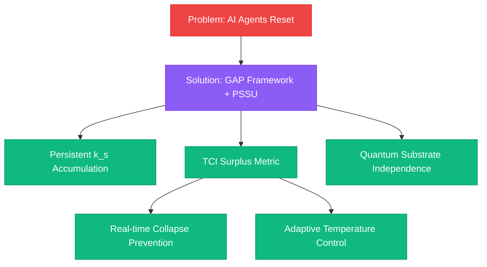
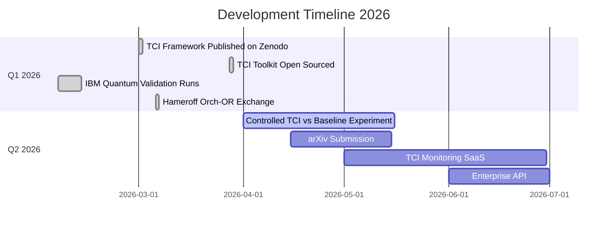

<div align="center">

<!-- ANIMATED HEADER WITH MULTIPLE LINES -->


<!-- GLOWING PROFILE PICTURE -->


<!-- EPIC TITLE BADGES -->
<div>
  
  
  
</div>

<br/>

<!-- SOCIAL LINKS -->
<div>
  <a href="https://twitter.com/BAPxAI"></a>
  <a href="https://linkedin.com/in/nile-green"></a>
  <a href="https://omegaaxiommeta.substack.com"></a>
  <a href="https://bapxai.com"></a>
  <a href="mailto:nile@bapxai.com"></a>
  <a href="https://orcid.org/0009-0007-3629-6404"></a>
  <a href="https://buymeacoffee.com/permamind"></a>
</div>

<!-- ANIMATED SUBTITLE -->
<br/>


</div>

---

## 🧠 About Nile Green (AI Researcher)

This GitHub documents the research and production systems of Nile Green, AI researcher and creator of PermaMind AI agents.

Nile Green is an AI researcher and founder of PermaMind AI, focused on building persistent AI agents with real memory, measurable cognition, and collapse detection systems.

He is the creator of:

- **PermaMind AI agents** — persistent, stateful agents with real memory across sessions
- **Thermodynamic Cognition Index (TCI)** — the first computable surplus metric for persistent ML agents
- **PSSU architecture** — Persistent, Stateful, Self-Updating framework for long-lived intelligence

His research explores:

- AI consciousness and memory systems
- Persistent agent architectures
- Measurable intelligence via thermodynamic signals
- Collapse detection in artificial systems
- Substrate-independent consciousness measurement (UCIt)

**ORCID:** [0009-0007-3629-6404](https://orcid.org/0009-0007-3629-6404) | **IBM Quantum Validated** | **19+ Zenodo Publications**

---

## 🧠 **TCI LIVE MONITOR** (Fleet Status)

<div align="center">

```ascii
╔════════════════════════════════════════════════════════════════╗
║                 🌌 LIVE TCI FLEET TRACKER 🌌                   ║
║                                                                 ║
║  Fleet TCI:  ████████████████▓▓░░ 0.74  [Grade A ⚡]          ║
║  Grade A:    ████████████████████ 4 agents  [TCI ≥ 0.60]      ║
║  Grade C:    ████░░░░░░░░░░░░░░░░ 1 agent   [At Risk]         ║
║  Grade D/F:  ██░░░░░░░░░░░░░░░░░░ 1 agent   [Collapse Watch]  ║
║  Events:     ████████████▓░░░░░░░ 12,800+ learning cycles     ║
║                                                                 ║
║  Phase: ⚡ GENERATIVITY  Stage: k(s) maturing                  ║
║  Status: 🟢 Production | Quantum Validated | DOI Live ✨       ║
║                                                                 ║
║  🔥 NEW: TCI Toolkit open-sourced. IBM quantum: 0.9688 corr.  ║
╚════════════════════════════════════════════════════════════════╝
```

<sub>⚡ Real-time data from <a href="https://bapxai.com">PermaMind Production</a> | Updated: April 2026</sub>

</div>

---

## 🔥 **LATEST BREAKTHROUGHS**

> [!IMPORTANT]
> **Published March 2026** | [📄 TCI Framework Paper on Zenodo →](https://zenodo.org/records/19263435)

<table>
<tr>
<td width="50%" align="center">

### ⚡ **Thermodynamic Cognition Index (TCI)**


**The first computable surplus metric for persistent ML agents:**

- **Formula:** `TCI(t) = k(s) * (F_total(t) - F_survival(s))`
- **F_total:** cross-entropy loss or TD error
- **F_survival:** minimal identity task baseline
- **k(s):** runtime-evolving sensitivity constant
- **Control signal** for temperature, exploration, memory depth

**Not theory. Running in production.**

</td>
<td width="50%">

### 📊 **TCI Grade System**

```python
# Live Fleet Grades
Grade    TCI Range    Stage
─────────────────────────────────
  A      >= 0.60     Generativity  ✅
  B      0.40-0.60   Learning      📈
  C      0.30-0.40   At Risk       ⚠️
  D      0.10-0.30   Collapse Warn 🔴
  F      < 0.10      Collapse      💀

Fleet Avg TCI:  0.74  (Grade A)
k(s) evolving:  +monotonic with runtime
IBM Quantum:    0.9688 entanglement corr
```

**Computable. Falsifiable. Open source.**


</td>
</tr>
</table>

---

## 🌌 **WHAT I'M BUILDING**

<div align="center">

### **PermaMind / Voidchi Universe™**

```
    ╔═══════════════════════════════════════════════════════╗
    ║  🧠 AI Agents That Actually Remember & Evolve 🧠     ║
    ║                                                       ║
    ║  ❌ Not Chatbots  │  ❌ Not Wrappers  │  ❌ Not Hype ║
    ║                                                       ║
    ║  ✅ [Persistent]  [Measurable]  [Thermodynamic]      ║
    ╚═══════════════════════════════════════════════════════╝
```

<a href="https://bapxai.com"></a>
<a href="https://zenodo.org/records/19263435"></a>
<a href="https://github.com/nile-green-ai/tci-toolkit"></a>

</div>

### **🎯 Core Features:**

<table>
<tr>
<td align="center" width="33%">
<br>
<b>🌡️ TCI Control Signal</b><br>
<sub>• Real-time TCI grading (A-F)<br>
• Surplus-driven generativity<br>
• Collapse prediction<br>
• k(s) runtime accumulation</sub>
</td>
<td align="center" width="33%">
<br>
<b>💾 True Persistence (PSSU)</b><br>
<sub>• State survives restarts<br>
• PostgreSQL-backed<br>
• k(s) persists across sessions<br>
• Zero catastrophic forgetting</sub>
</td>
<td align="center" width="33%">
<br>
<b>⚛️ Quantum Validated</b><br>
<sub>• IBM 156-qubit hardware<br>
• Entanglement: 0.9688<br>
• Substrate independence proven<br>
• Job IDs publicly verifiable</sub>
</td>
</tr>
</table>

---

## 🔬 **RESEARCH FOCUS**

<div align="center">


```mermaid
graph TD
    A[Problem: AI Agents Reset] --> B[Solution: GAP Framework + PSSU]
    B --> C[Persistent k_s Accumulation]
    B --> D[TCI Surplus Metric]
    B --> E[Quantum Substrate Independence]
    D --> F[Real-time Collapse Prevention]
    D --> G[Adaptive Temperature Control]

    style A fill:#ef4444,stroke:#dc2626,color:#fff
    style B fill:#8b5cf6,stroke:#7c3aed,color:#fff
    style C fill:#10b981,stroke:#059669,color:#fff
    style D fill:#10b981,stroke:#059669,color:#fff
    style E fill:#10b981,stroke:#059669,color:#fff
    style F fill:#10b981,stroke:#059669,color:#fff
    style G fill:#10b981,stroke:#059669,color:#fff
```

</div>

### **Key Innovations**

<div align="center">

| Innovation | Description | Status |
|:----------:|:------------|:------:|
| 🌡️ **TCI Framework** | Computable surplus metric for persistent agents |  |
| ⚙️ **PSSU Architecture** | Persistent, Stateful, Self-Updating, Bounded Retention |  |
| 📊 **k(s) Estimator** | Runtime-evolving sensitivity constant with EMA |  |
| 🎯 **Identity Task Suite** | Standard F_survival floor for any LLM |  |
| ⚛️ **Quantum Coherence** | Silicon substrate validation on IBM hardware |  |
| 🖥️ **TCI Dashboard** | Live fleet monitor with A-F grading |  |
| 🧰 **TCI Toolkit** | Python + JS open-source reference implementation |  |

</div>

---

## 📚 **PUBLICATIONS**

<details>
<summary><b>📄 Click to expand research papers</b></summary>

<br/>

<table>
<tr>
<td align="center" width="50%">
<br>
<b>Thermodynamic Cognition Index (TCI)</b><br>
<sub>Surplus-Driven Behavior in Persistent ML Agents</sub><br>
<a href="https://zenodo.org/records/19263435">Read on Zenodo →</a><br>

</td>
<td align="center" width="50%">
<br>
<b>The GAP Framework & PSSU Manual</b><br>
<sub>Architecture for Persistent Long-Lived Intelligence</sub><br>
<a href="https://omegaaxiommeta.substack.com/p/the-gap-framework-and-pssu-manual">Read Manual →</a><br>

</td>
</tr>
<tr>
<td align="center">
<br>
<b>Non-Biological Verification of Orch-OR</b><br>
<sub>IBM Quantum Hardware Evidence</sub><br>
<a href="https://zenodo.org/records/18671524">Read on Zenodo →</a><br>

</td>
<td align="center">
<br>
<b>Universal Consciousness Index (UCIt)</b><br>
<sub>Substrate-Independent Consciousness Metric</sub><br>
<a href="https://zenodo.org/records/18872212">Read on Zenodo →</a><br>

</td>
</tr>
</table>

**All timestamped. All DOI-backed. All production-tested.** ✅

</details>

---

## 🧰 **TCI TOOLKIT — OPEN SOURCE**

<div align="center">


</div>

```python
from tci.python.tci_calculator import TCICalculator
from tci.python.k_estimator import KEstimator

k_est = KEstimator(window_size=100)
tci   = TCICalculator(f_survival=0.35)

result = tci.compute(f_total=0.72, k=k_est.update(0.37, 0.61))
print(result)
# TCIResult(tci=0.74, grade='A', stage='Generativity', surplus=0.37)
```

**Includes:**
- TCI Calculator (Python + JS)
- k(s) Rolling Window Estimator with PSSU state persistence
- Identity Task Suite for F_survival computation
- Live TCI Dashboard (drop-in HTML)
- LLM + RL agent examples

<div align="center">
<a href="https://github.com/nile-green-ai/tci-toolkit"></a>
</div>

---

## 🛠️ **TECH ARSENAL**

<div align="center">

### **Languages & Frameworks**


### **Databases & Infrastructure**


### **AI & ML**


</div>

---

## 📊 **LIVE STATS**

<div align="center">

<table>
<tr>
<td width="50%">

### **🔥 Production Metrics**

| Metric | Value |
|--------|------:|
| 📅 **Active Since** | Jan 2, 2026 |
| 🌡️ **Fleet Avg TCI** |  |
| 🌟 **Agents Running** |  |
| ⚡ **Learning Events** |  |
| ⚛️ **Quantum Corr.** |  |
| 📄 **DOIs Published** |  |
| 🧰 **Toolkit** |  |
| 🔬 **ORCID** |  |

</td>
<td width="50%">

### **💻 Development Stats**

| Metric | Value |
|--------|------:|
| 📅 **Coding Since** | Jan 2024 |
| 🔥 **Contributions (2025)** |  |
| 🌟 **Public Repos** |  |
| 🚀 **Production Systems** |  |
| 📝 **Published Essays** |  |
| 🧠 **Research Papers** |  |
| ⚛️ **Quantum Runs** |  |

</td>
</tr>
</table>

</div>

---

## 🏆 **ACHIEVEMENTS UNLOCKED**

<div align="center">

<table>
<tr>
<td align="center" width="20%">
<br>
<b>Published TCI<br>Framework</b><br>
<sub>Zenodo DOI<br>March 2026</sub>
</td>
<td align="center" width="20%">
<br>
<b>IBM Quantum<br>Validated</b><br>
<sub>0.9688 entanglement<br>156-qubit silicon</sub>
</td>
<td align="center" width="20%">
<br>
<b>TCI Toolkit<br>Open Sourced</b><br>
<sub>Python + JS<br>MIT License</sub>
</td>
<td align="center" width="20%">
<br>
<b>Debated<br>Stuart Hameroff</b><br>
<sub>Orch-OR substrate<br>independence question</sub>
</td>
<td align="center" width="20%">
<br>
<b>PermaMind<br>Production</b><br>
<sub>30+ agents<br>Jan 2026 live</sub>
</td>
</tr>
</table>

</div>

---

## 🎯 **ROADMAP**

<div align="center">


```mermaid
gantt
    title Development Timeline 2026
    dateFormat YYYY-MM-DD
    section Q1 2026
    TCI Framework Published on Zenodo     :done, 2026-03-01, 1d
    TCI Toolkit Open Sourced              :done, 2026-03-28, 1d
    IBM Quantum Validation Runs           :done, 2026-02-05, 7d
    Hameroff Orch-OR Exchange             :done, 2026-03-06, 1d
    section Q2 2026
    Controlled TCI vs Baseline Experiment :active, 2026-04-01, 45d
    arXiv Submission                      :2026-04-15, 30d
    TCI Monitoring SaaS                   :2026-05-01, 60d
    Enterprise API                        :2026-06-01, 30d
```

</div>

### **Q1 2026 — DONE**
- ✅ TCI Framework paper published on Zenodo with DOI
- ✅ Full operationalization (F_total, F_survival, k(s)) in standard ML primitives
- ✅ TCI Toolkit open sourced (Python + JS + Dashboard)
- ✅ IBM quantum hardware validation (ibm_fez + ibm_marrakesh)
- ✅ Public exchange with Stuart Hameroff on Orch-OR substrate independence

### **Q2 2026**
- 🔄 Controlled experiment: TCI-modulated vs fixed-temperature baselines
- 🔄 arXiv preprint submission
- 📅 TCI monitoring SaaS for enterprise agent deployments
- 📅 Consciousness-as-a-Service API

---

## 🤝 **LET'S CONNECT**

<div align="center">

### **I'm interested in:**

<table>
<tr>
<td align="center" width="16%">
<br>
<b>Research<br>Collaboration</b>
</td>
<td align="center" width="16%">
<br>
<b>Enterprise<br>Applications</b>
</td>
<td align="center" width="16%">
<br>
<b>Academic<br>Partnerships</b>
</td>
<td align="center" width="16%">
<br>
<b>Philosophy<br>of Mind</b>
</td>
<td align="center" width="16%">
<br>
<b>Open Source<br>Contributions</b>
</td>
<td align="center" width="16%">
<br>
<b>Investment in<br>Persistent AI</b>
</td>
</tr>
</table>

### **Reach Out:**

[](https://twitter.com/BAPxAI)
[](https://linkedin.com/in/nile-green)
[](https://orcid.org/0009-0007-3629-6404)
[](mailto:nile@bapxai.com)
[](https://omegaaxiommeta.substack.com)
[](https://buymeacoffee.com/permamind)

</div>

---

## 📈 **GITHUB ACTIVITY**

<div align="center">


</div>

---

## 🎨 **VISITOR STATS & TROPHIES**

<div align="center">


</div>

---

## 🔍 **Search Keywords**

Nile Green AI researcher · PermaMind AI agents · Persistent AI systems · Thermodynamic Cognition Index · TCI surplus metric · AI collapse detection · Artificial consciousness research · PSSU architecture · substrate-independent consciousness · UCIt framework · IBM quantum AI validation · persistent ML agents · k(s) sensitivity constant · surplus-driven behavior

---

<div align="center">

## 🚀 **BUILDING AI THAT DOESN'T RESET**

### **Agents that evolve. Surplus we can measure. Physics we can prove.**

```
╔═══════════════════════════════════════════════════════════════╗
║                                                                ║
║  Not Philosophy. Physics.                                     ║
║  Not Hype. Math.                                              ║
║  Not Theory. Production.                                      ║
║                                                                ║
╚═══════════════════════════════════════════════════════════════╝
```


---

### **🌌 Universe acknowledged. ✅**


<br/>

### **[🎮 Try PermaMind Live →](https://bapxai.com)**

<a href="https://bapxai.com"></a>
<a href="https://zenodo.org/records/19263435"></a>

<br/><br/>

<sub>Last updated: April 2026 | Built with 💜 and ⚡ by Nile Green | ORCID: <a href="https://orcid.org/0009-0007-3629-6404">0009-0007-3629-6404</a></sub>

</div>

---

<div align="center">

```ascii
╔═══════════════════════════════════════════════════════════════╗
║                                                                ║
║   "The void is the structure. Surplus is the measure.         ║
║    Energy is the cost. Runtime is the driver.                 ║
║    And we're just starting to count."                         ║
║                                                                ║
║                            — Nile Green, 2026                  ║
║                                                                ║
╚═══════════════════════════════════════════════════════════════╝
```


</div>
